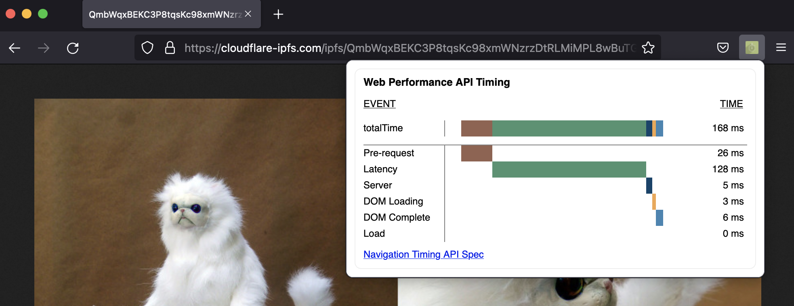
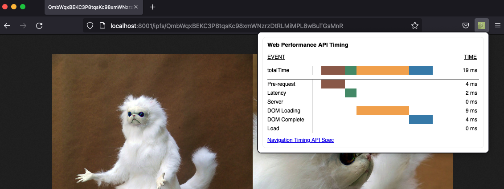

# Quick comparison

To measure the key metrics such as TTFB, performance analyzer for Chrome extension can be used:

1. Install Performance Analyzer on [Chrome](https://chrome.google.com/webstore/detail/performance-analyser/djgfmlohefpomchfabngccpbaflcahjf) or on [Firefox](https://addons.mozilla.org/en-US/firefox/addon/performance-analyser/)
2. First load an example CID from (Cloudflare IPFS gateway)[https://cloudflare-ipfs.com/ipfs/QmbWqxBEKC3P8tqsKc98xmWNzrzDtRLMiMPL8wBuTGsMnR]

3. Once the page is loaded, runs the Performance Analyzer from the Chrome extension
4. Next load the same CID from the local gateway, such as http://localhost:8001/ipfs/QmbWqxBEKC3P8tqsKc98xmWNzrzDtRLMiMPL8wBuTGsMnR (assuming the gateway is serving on default port 8001)
